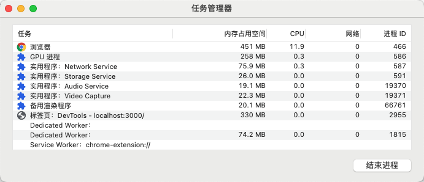
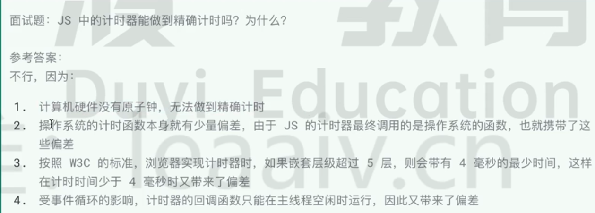

# 事件循环

## 浏览器的进程模型

程序运行需要有自己专属的内存空间，这块内存空间就可以简单的理解为进程。
每个程序至少需要一个进程，进程之间是互相独立的，不会相互影响。如果需要进程间需要通信，需要双方都同意。

## 浏览器有哪些主要的进程和线程

浏览器是一个**多进程多线程**的应用程序。
浏览器的内部实现及其复杂。为了避免互相干扰，减少连环崩坏的几率，当启动浏览器后，它会自动启动多个进程。

其中几个主要的进程有：

- 浏览器进程（主进程）

  - 协调控制其他子进程（创建、销毁）
  - 浏览器界面显示，用户交互，前进、后退、收藏
  - 将渲染进程得到的内存中的 Bitmap，绘制到用户界面上
  - 内部会启动多个线程来处理不同的任务

- 网络进程

  - 加载网络资源。内部会启动多个线程来处理不同的任务。

- 渲染进程

  - 渲染进程启动后会启动一个**渲染主线程**。负责执行 HTML、CSS、JS 代码。
  - 默认情况下浏览器会给每个打开的标签页开启一个**新的渲染进程**，来保证不同页面之间不受影响。

## 面试题

> **单线程是异步产生的原因。**  
> **事件循环是异步的实现方式。**
