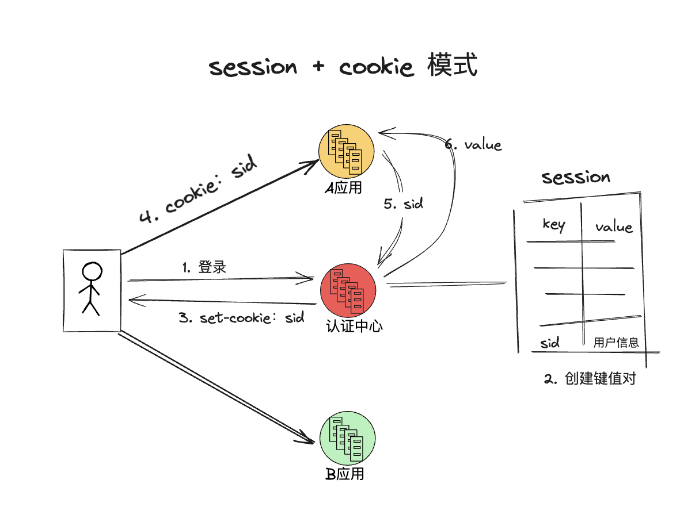
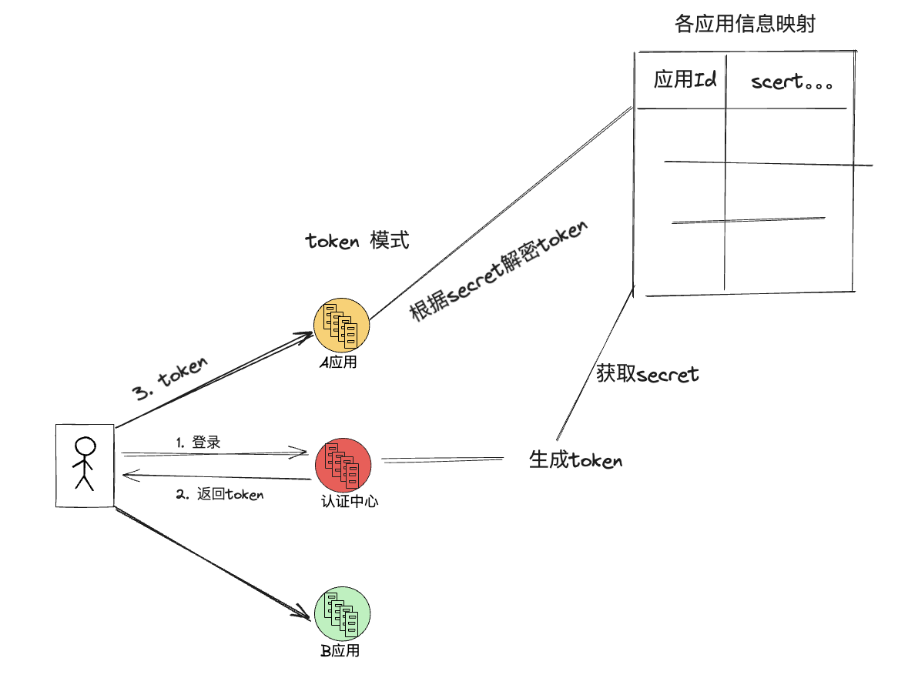

# 单点登录

## 什么是单点登录

单点登录（Single Sign-On，简称 SSO）是一种用户登录的方式，它允许用户在一个网站上登录，然后在该网站的其他子网站或应用程序上自动登录，而无需再次输入凭证。

## 为什么要使用单点登录

现在的 web 应用群越来越复杂，比如小米的应用，小米官网，小米商城，这些功能独立的应用，肯定是单独拆成一个项目维护的。如果每个应用都设置一遍登录注册页面，用户信息会变得难以维护，而且存在安全风险，同时用户也不可能没到一个系统就出现登录注册一遍，这样的体验是非常不友好的。

在这一背景下也就因此的单点登录这个解决方案。所有系统都通过一个独立的认证中心，只有认证中心能接受用户的用户名密码等安全信息，其他系统不提供登录入口，只接受认证中心的间接授权。

## 实现单点登录的两种方案

### session + cookie

优点：

1. 认证中心对用户的登录状态就有很高的可控性。

缺点：

1. 用户每次请求登录都要走一遍认证中心，认证中心的压力非常大，而且不方便扩容。

### token

优点：

1. 认真执行通过和子系统共享生成 token 的密钥的方式，后续用户的请求是否登录，各个子系统间可以自行判断。

缺点：

1. 认证中心对用户的登录状态的可控性不高，没办法立刻下掉一个用户的登录态。

这也就引出了双 token 的概念，用户登录后给用户返回两个 token，一个短 token，一个长 token，短用于判断用户的登录态，但是过期时间很长，过期后可以通过长 token 重新去认证中心获取短 token，这样认真中心就有机会对用户的登录态进行控制。
